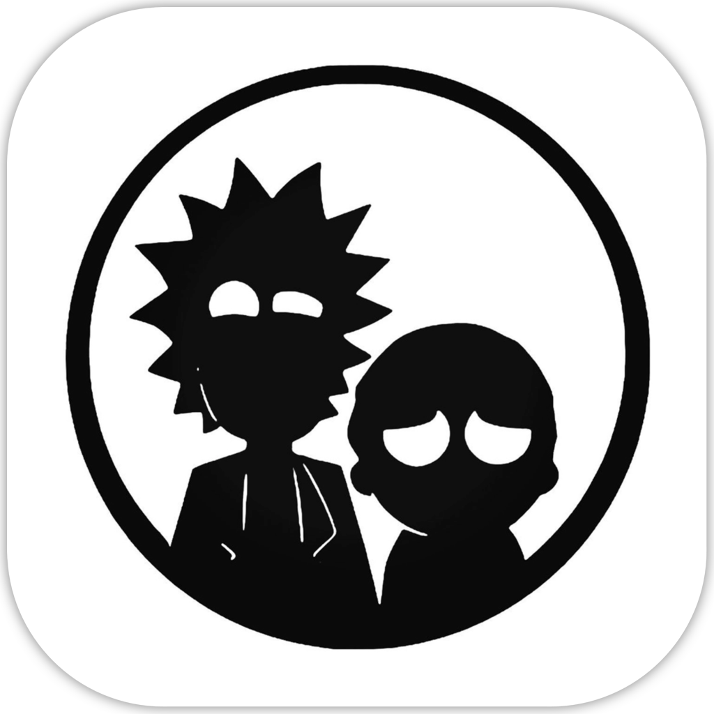

<!-- Header -->

	
	<h1>Rick and Morty</h1>

  
  
  
  

<!-- Body -->
## Frameworks / External dependencies
None

## Description
This simple application displays a list of Rick and Morty episodes. If the user taps on an episode another list appears showing the characters in that episode split into dead or alive and displayed in the order in which they were created. If the user taps on a character then a screen showing the character’s picture and information pops up.

Finally there is an additional functionality that allows the user to kill characters and everything in the model is updated accordingly.

## App preview
Those are the most relevant screenshots showing the overall result of the project.

  
  
  

<!-- Footer -->