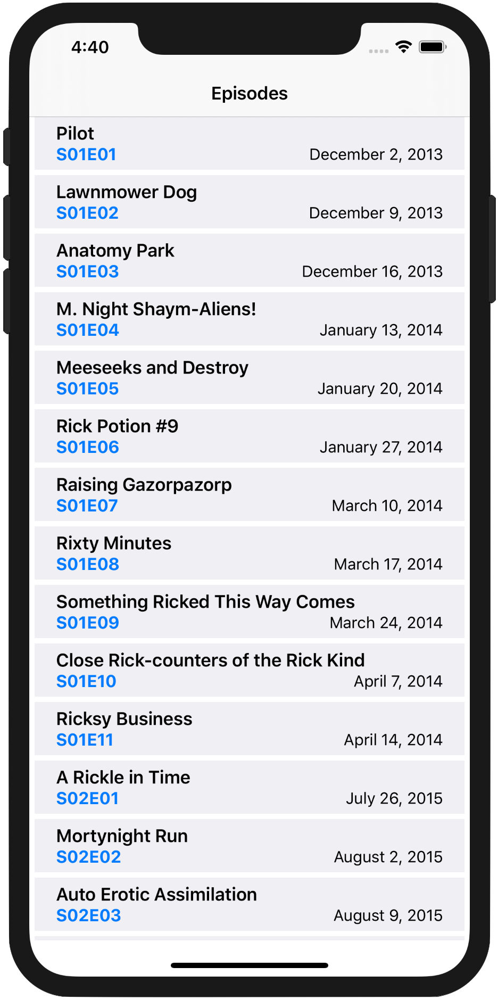
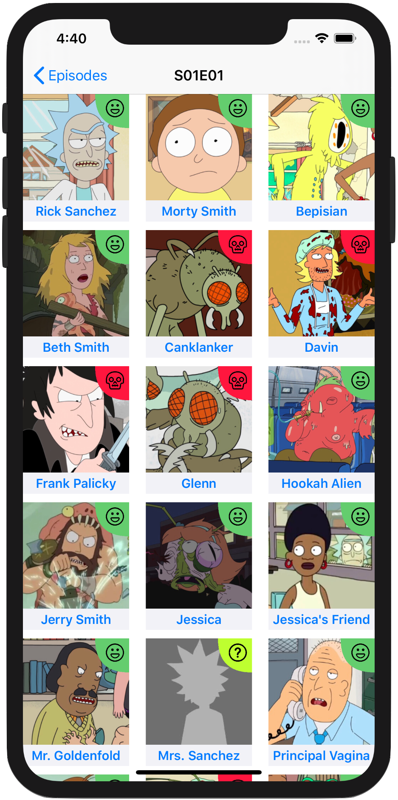
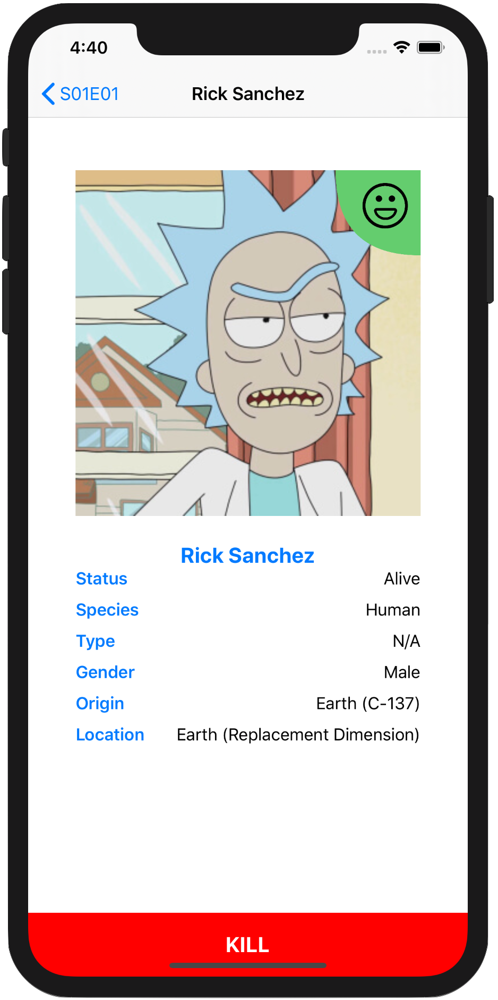

<!-- HEADER -->

<h1>Rick and Morty</h1>

[][Swift]
[][iOS]
[][Twitter]

<!-- BODY -->
## Documentation
- [Rick and Morthy API](https://rickandmortyapi.com)

## Frameworks/External dependencies
- Foundation
- UIKit

## Description
This app **fetches Rick and Morty's episodes**, from the [Rick And Morty public API](https://rickandmortyapi.com), and displays them on a list. When the user taps on an episode a collection-view appears **showing all the corresponding characters in that episode, split into dead or alive, and sorted in the order in which they were created**. If the user taps on a character then a screen showing the character’s picture and information pops up.

Finally there is an additional functionality that **allows the user to kill characters** and everything in the model is updated accordingly.

## Preview
Those are the most relevant screenshots of the project.

	
	
	

<!-- FOOTER -->
<!-- Permanent links -->
[Swift]: https://www.swift.org
[iOS]: https://developer.apple.com/ios/
[Twitter]: https://twitter.com/BEstelrich